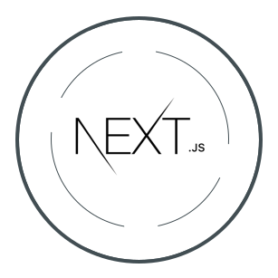

# AppXen Next.js Server



A containerized Next.js environment. Deploy it anywhere, or with one-click on AWS.

## Getting Started

Ensure you have docker installed, and simply run:

```bash
docker compose up --build
```

This will begin the next.js server on PORT 80 of your localhost. You can change the port mapping in `docker-compose.yml`. Outside of docker you can also run the next `app` with `npm`

```bash
cd app 
npm run dev
```

To deploy a production version:

```bash
cd app
npm run build
```

Then run the container as shown above. The server by default runs `npm start`, which will expect a production build of the application (e.g., per next.js). 

## Run your own App

The `app/` is simply a next.js generated application. You can generate or compile your own app with this server. Just copy the `app/Dockerfile` into your own app (replacing the `app/` directory).